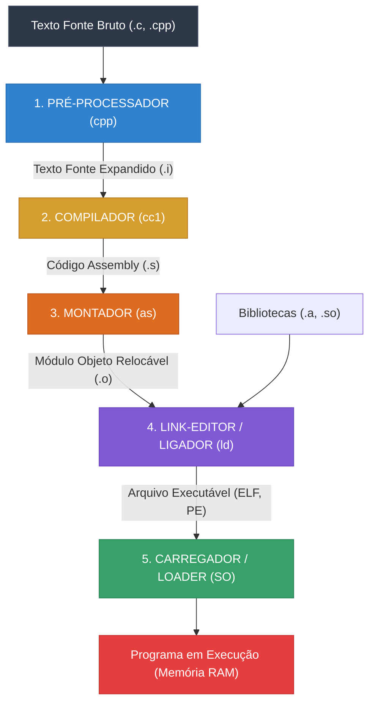
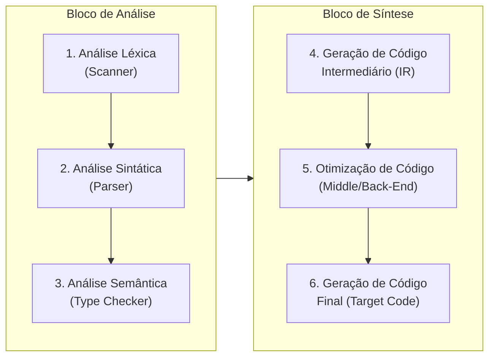

# 📚 Teoria e Construção de Compiladores


---

## 🧭 Visão Geral

Este repositório reúne notas estruturadas, diagramas conceituais e exemplos práticos da **1ª Unidade da disciplina de Compiladores**. O conteúdo abrange desde os fundamentos taxonômicos de tradutores e linguagens de programação até os detalhes internos da arquitetura de compiladores modernos (como GCC e LLVM), decompostos nos modelos **Análise-Síntese** e **Front-End / Back-End**.

> [!NOTE]
> Todos os arquivos de notas originais em formato Markdown encontram-se organizados na pasta [`1ª Unidade`](./1ª%20Unidade/).

---

## 🗺️ Mapa de Conteúdo (1ª Unidade)

```
Compiladores/
│
├── README.md                                          # Visão geral e guia mestre do repositório
│
└── 1ª Unidade/
    ├── Tradutor.md                                    # Teoria geral da tradução e preservação semântica
    ├── Compilador.md                                  # Definição formal, compile-time vs runtime
    ├── Interpretador.md                               # Tradução e execução concomitantes
    ├── Montador.md                                    # Assembly para código de máquina (mapeamento 1:1)
    ├── Processo de Tradução de um Código.md           # Toolchain canônica (pré-processador até loader)
    │
    ├── Classificações de Linguagens/
    │   ├── Linguagem de Programação.md                # O espectro de abstração e desmistificação do "médio nível"
    │   ├── Classificação por Dependência de Máquina.md# LLL, HLL, VHLL e POL
    │   ├── Classificação por Geração das Linguagens de Programação.md # 1GL a 5GL
    │   ├── Classificação por Paradigma Mais Geral.md  # Imperativo ("como") vs Declarativo ("o que")
    │   └── Classificação por Paradigma de Programação.md # Procedural, OO, Funcional, Lógico, Concorrente
    │
    ├── Compiladores Especiais/
    │   ├── Pré-Processador.md                         # Inclusão, macros (#, ##), expansão de sintaxe
    │   ├── Transpilador.md                            # Compilação source-to-source (TS -> JS)
    │   └── Filtros.md                                 # Saneamento e transformações sem tradução formal
    │
    ├── Funcionamento de um compilador/
    │   ├── Modelo Análise-Síntese.md                  # Princípio de divisão e conquista
    │   ├── Modelo Front-end Back-End.md               # O problema N x M e o papel da IR / LLVM
    │   ├── Bloco de Análise (Analysis).md             # Léxica (Scanner), Sintática (Parser) e Semântica
    │   ├── Bloco de Síntese (Synthesis).md            # Código Intermediário, Otimização e Código Final
    │   ├── Barramentos Transversais.md                # Tabela de Símbolos e Tratamento de Erros
    │   └── Exemplo de Sala.md                         # Passo a passo completo: POS := 5 + 7 * TEMPO
    │
    └── Tradutores de Engenharia Reversa/
        ├── Tradutor de Engenharia Reversa.md          # Objeto -> aproximação do fonte
        ├── Desmontador.md                             # Binário -> Assembly
        ├── Decompilador.md                            # Binário/Bytecode -> Linguagem de Alto Nível
        └── Ofuscador.md                               # Destruição proposital da legibilidade defensiva
```

---

## 🏛️ Núcleo Teórico: O Conceito de Tradutor

Um **tradutor** é qualquer entidade (humana, lógica ou mecânica) que recebe um **texto-fonte** em uma **linguagem-fonte** e gera um **texto-objeto** equivalente em uma **linguagem-objeto**.

```
[ Texto Fonte (Linguagem Fonte) ] ──► ⟦ TRADUTOR ⟧ ──► [ Texto Objeto (Linguagem Objeto) ]
```

### O Contrato Fundamental
Toda tradução formal opera sob dois pilares invioláveis:
1. **Preservação Semântica (Equivalência de Significados):** O texto objeto gerado, quando executado, deve produzir exatamente o mesmo comportamento lógico observável estipulado pelo texto fonte.
2. **Preservação de Informações Relevantes:** Detalhes superficiais sem valor executável (comentários, espaçamentos, identações) são descartados para otimizar o fluxo de análise.

---

## 🗂️ Taxonomia dos Tradutores

| Tradutor | Linguagem Fonte | Linguagem Objeto | Momento de Tradução | Artefato Gerado |
| :--- | :--- | :--- | :--- | :--- |
| **[Compilador](./1ª%20Unidade/Compilador.md)** | Alto Nível | Baixo Nível (ou Intermediário) | Antecipada (*Ahead-of-Time*) | Arquivo Objeto / Binário estático |
| **[Interpretador](./1ª%20Unidade/Interpretador.md)** | Alto Nível | Execução Direta | Em tempo de execução (*Runtime*) | Nenhum arquivo objeto persistido |
| **[Montador](./1ª%20Unidade/Montador.md)** | Assembly (Mnemônicos) | Código de Máquina | Antecipada | Módulo Objeto Relocável (`.o`) |
| **[Transpilador](./1ª%20Unidade/Compiladores%20Especiais/Transpilador.md)** | Alto Nível ($L_A$) | Alto Nível ($L_B$) | Pré-execução (*Source-to-Source*) | Código fonte de alto nível |
| **[Desmontador](./1ª%20Unidade/Tradutores%20de%20Engenharia%20Reversa/Desmontador.md)** | Código de Máquina | Assembly | Engenharia Reversa | Mnemônicos Assembly legíveis |
| **[Decompilador](./1ª%20Unidade/Tradutores%20de%20Engenharia%20Reversa/Decompilador.md)** | Código de Máquina / Bytecode | Alto Nível | Engenharia Reversa | Código estruturado aproximado |
| **[Ofuscador](./1ª%20Unidade/Tradutores%20de%20Engenharia%20Reversa/Ofuscador.md)** | Alto Nível ($L_A$) | Alto Nível ($L_A$ ofuscado) | Pré-distribuição | Código semântico equivalente ilegível |

### Compilação vs Interpretação

```
COMPILAÇÃO:
[ Código Fonte ] ──► [ Compilador ] ──► [ Executável ] ──(CPU)──► [ Execução ]

INTERPRETAÇÃO:
[ Código Fonte ] ──┐
                   ├──► [ Interpretador (Runtime) ] ──(CPU)──► [ Execução Imediata ]
[ Entradas ]     ──┘
```


> [!tip]
> **Compile-Time vs Runtime**:
> - No *Compile-Time*, a CPU executa o compilador. Detectam-se erros de sintaxe e tipos estáticos.
> - No *Runtime*, a CPU executa o seu programa gerado. Ocorrem divisões por zero, estouro de memória e chamadas ao sistema operacional.


---

## ⚙️ A Cadeia de Ferramentas (*Toolchain*)

A transformação de código bruto em processos em execução na RAM segue a **Cadeia Canônica de Construção**:



1. **[Pré-Processador](./1ª%20Unidade/Compiladores%20Especiais/Pr%C3%A9-Processador.md):** Realiza interpolação textual pura. Resolve diretivas (`#include`), expansão de macros (`#define`), compilação condicional (`#ifdef`), concatenação de tokens (`##`) e stringificação (`#`).
2. **[Compilador](./1ª%20Unidade/Compilador.md):** Traduz o código fonte puro em linguagem Assembly, realizando análises formais e otimizações.
3. **[Montador](./1ª%20Unidade/Montador.md):** Converte mnemônicos em código de máquina binário, gerando a tabela de símbolos e tabela de realocação no módulo objeto (`.o`).
4. **Link-Editor (Linker):** Combina múltiplos arquivos objetos e bibliotecas, resolvendo referências externas e calculando endereçamento global.
5. **Loader:** Aloca espaço na memória RAM, cria as estruturas de *Stack* e *Heap*, resolve endereços dinâmicos e transfere o controle da CPU para o ponto de entrada (`_start`/`main`).

---

## 🏗️ Modelos Arquiteturais de um Compilador

### 1. O Modelo Análise-Síntese

Divide o processo de compilação em duas etapas complementares:

```
[ Código Fonte ] ──► ⟦ BLOCO DE ANÁLISE (Front-End) ⟧ ──► [ IR ] ──► ⟦ BLOCO DE SÍNTESE (Back-End) ⟧ ──► [ Código Objeto ]
```

- **Bloco de Análise (Front-End):** Domínio da **linguística formal e lógica**. Compreende e valida o código-fonte (léxica, sintática, semântica). Independente do hardware.
- **Bloco de Síntese (Back-End):** Domínio da **microarquitetura e da física**. Concretiza o algoritmo nas instruções do processador, alocando registradores físicos e otimizando pipelines de execução.

### 2. O Modelo Front-End / Back-End e o Problema $N \times M$

Se existem $N$ linguagens e $M$ processadores:
- **Modelo Monolítico:** Demanda $N \times M$ compiladores independentes.
- **Modelo com Representação Intermediária (IR):** Demanda apenas $N \text{ Front-Ends} + M \text{ Back-Ends}$.

```
[ Clang (C/C++) ] ──┐                                  ┌──► [ Backend x86-64 ]
[ rustc (Rust) ]   ──┼──►   LLVM IR (Contrato Comum)   ┼──► [ Backend ARM64 ]
[ Swift ]          ──┘                                  └──► [ Backend RISC-V ]
```

> [!IMPORTANT]
> **A Revolução LLVM na Indústria**:
> Em compiladores modernos, o Front-End representa cerca de **20% a 25%** do esforço de desenvolvimento, o Middle-End representa **40% a 50%**, e o Back-End cerca de **25% a 35%**.
> Graças a essa arquitetura, linguagens como **Rust, Swift, Julia e Zig** puderam surgir com desempenho topo de linha: seus criadores implementaram apenas o Front-End, aproveitando 75% a 80% do ecossistema de otimização e geração de código nativo já pronto na LLVM.

---

## 🔄 As Fases Sequenciais de Compilação



### Barramentos Transversais
Dois componentes essenciais atravessam verticalmente todas as fases:
1. **[Tabela de Símbolos](./1ª%20Unidade/Funcionamento%20de%20um%20compilador/Barramentos%20Transversais.md):** Estrutura hierárquica (árvores ou pilhas de *hash tables*) para gerenciar escopos, tipos, parâmetros e deslocamentos em memória.
2. **[Tratamento e Recuperação de Erros](./1ª%20Unidade/Funcionamento%20de%20um%20compilador/Barramentos%20Transversais.md):** Estratégias como *Modo Pânico* (avanço até tokens de sincronização como `;` ou `}`) e inserção de tipos coringa (`type_error`) para evitar erros em cascata.

---

## 🏷️ Classificações de Linguagens

```
                                  Linguagens de Programação
                                              │
         ┌────────────────────────────────────┼────────────────────────────────────┐
         ▼                                    ▼                                    ▼
 Dependência de Máquina                    Gerações                         Paradigmas Gerais
 ├── LLL  (Assembly, Binário)              ├── 1GL (Máquina)                ├── Imperativo ("Como fazer")
 ├── HLL  (C, Go, Rust, Java)              ├── 2GL (Assembly)               └── Declarativo ("O que fazer")
 ├── VHLL (Python, SQL, MATLAB)            ├── 3GL (Estruturadas / HLL)
 └── POL  (GPSS, STRESS - DSLs)            ├── 4GL (Bancos / Domínio)
                                           └── 5GL (Lógica / IA Clássica)
```

> [!NOTE]
> **Mito do "Médio Nível"**: Na Ciência da Computação formal, C e C++ são categorizadas estritamente como linguagens de **alto nível**. O rótulo "médio nível" é apenas um jargão didático ou comercial para indicar que essas linguagens expõem acesso a ponteiros e registradores sem abrir mão da portabilidade algorítmica.

---

## 💻 Como Utilizar Este Repositório

 **Para Estudo Autônomo:**
   - Siga a ordem recomendada na seção [Mapa de Conteúdo](#-mapa-de-conte%C3%BAdo-1%C2%AA-unidade).
   - Consulte o [Estudo de Caso Prático](#-estudo-de-caso-pr%C3%A1tico-o-exemplo-de-sala) para fixar a mecânica de cada fase.

---


  <sub>Material compilado e estruturado a partir das anotações e conteúdos da disciplina de Compiladores.</sub>
</div>

